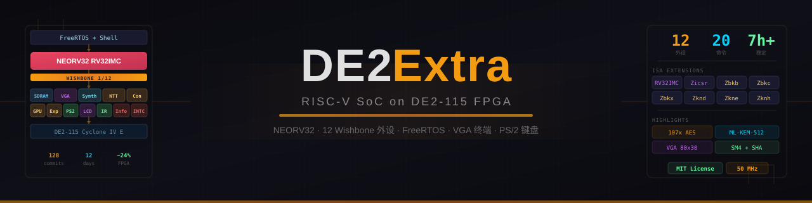
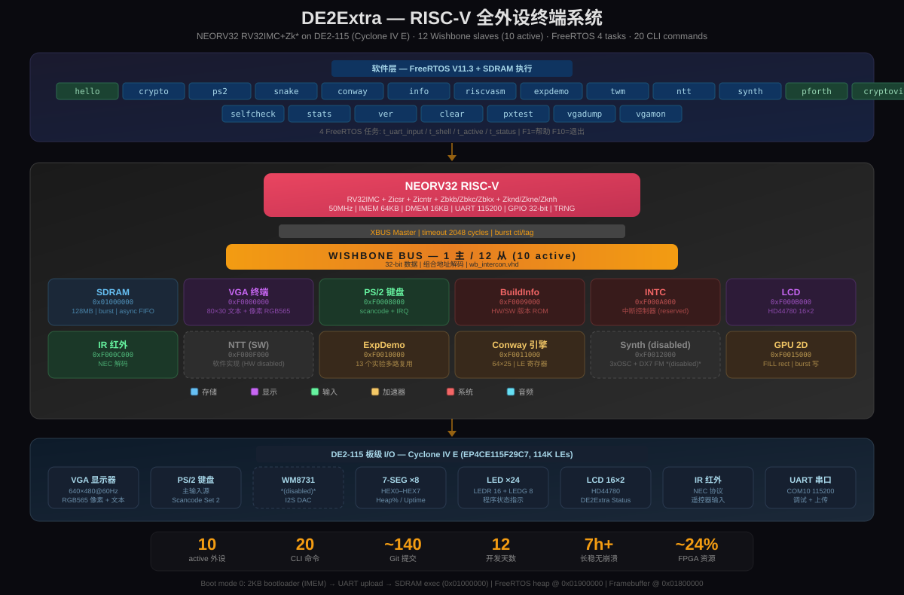

<p align="center">
  
</p>

<h3 align="center">
  DE2Extra：基于 DE2-115 的 RISC-V SoC
</h3>

<p align="center">
  
  
  
  
  
</p>

<p align="center">
  <a href="README.en.md">English</a> | 中文
</p>

---

## 项目概览

DE2Extra 是一个基于 [NEORV32](https://github.com/stnolting/neorv32) RISC-V 软核的完整 SoC 系统，运行在 Altera DE2-115 (Cyclone IV E, 114K LEs) FPGA 开发板上。围绕开源 CPU 核心自研了 10 个活跃 Wishbone 外设 IP、SoC 互联、FreeRTOS 固件及 22 个命令行应用。

| | |
|---|---|
| **CPU** | NEORV32 v1.13.1 · RV32IMC + Zicsr + Zicntr + Zbkb/Zbkc/Zbkx/Zknd/Zkne/Zknh/Zksed/Zksh |
| **总线** | Wishbone B4 · 1 主 / 12 从 (10 active, 2 stub) · 32-bit · 组合地址解码 |
| **固件** | FreeRTOS V11.3 · 4 任务 (uart_input/shell/active/status) · ~207KB |
| **启动** | Boot mode 0: 2KB IMEM bootloader → UART 上传 → SDRAM @ `0x01000000` |
| **显示** | VGA 640×480 @60Hz · 80×30 文本模式 + RGB565 像素模式 · GPU 2D FILL |
| **输入** | PS/2 键盘 (主输入) · UART 115200 · IR NEC 红外遥控 |
| **加速** | AES-128 硬件 **107.6×** 加速 · Conway 64×25 硬件引擎 |
| **板级** | SDRAM 128MB · HD44780 LCD 16×2 · 7-SEG ×8 · LED ×24 |

## 系统架构

<p align="center">
  
</p>

详见: [交互式架构图](doc/promo/architecture.html) · [演示文稿](doc/promo/slides.html)

## 外设一览

| 外设 | 地址 | 说明 | 上板 |
|------|------|------|:----:|
| `sdram_ctrl` | `0x01000000` | 128MB, burst, async FIFO CDC | ✅ |
| `vga_text_terminal` | `0xF0000000` | 80×30 文本 + 640×480 RGB565 像素 | ✅ |
| `ps2_controller` | `0xF0008000` | PS/2 键盘, scancode + IRQ | ✅ |
| `build_info_wb` | `0xF0009000` | HW/SW 版本 ROM | ✅ |
| `lcd_wb` | `0xF000B000` | HD44780 16×2 LCD | ✅ |
| `ir_nec_wb` | `0xF000C000` | NEC 红外解码 | ✅ |
| `ntt_sdf` | `0xF000F000` | NTT 加速器 (HW 已从综合移除, SW 替代) | ⚠️ |
| `expdemo_wb` | `0xF0010000` | 13 个课程实验硬件多路复用 | ✅ |
| `conway_engine` | `0xF0011000` | Conway 64×25 硬件引擎 | ✅ |
| `synth_engine` | `0xF0012000` | 3×OSC + DX7 FM, WM8731 *(HW 已移除)* | — |
| `gpu_2d` | `0xF0015000` | FILL rect, SDRAM burst 写 | ✅ |

完整板级验证状态: [`doc/phases/de2os-rtos-status.md`](doc/phases/de2os-rtos-status.md)

## CLI 命令 (22 个)

**交互程序** (F1=帮助, F10=退出):

`hello` · `crypto` · `ps2` · `snake` · `conway` · `info` · `riscvasm` · `expdemo` · `twm` · `ntt` · ~~`synth`~~ · `pforth` · `cryptoviz`

**工具命令**:

`selfcheck` · `postverify` · `stats` · `ver` · `clear` · `pxtest` · `vgadump` · `vgamon`

## 目录结构

```
DE2Extra/
├── neorv32/                   # NEORV32 RISC-V CPU (submodule, v1.13.1)
├── src/rtl/                   # VHDL 源码
│   ├── de2os_top.vhd          # 顶层实体 (唯一 Quartus 工程)
│   ├── bus/wb_intercon.vhd    # 1 主 / 12 从地址解码
│   ├── periph/                # 12 个外设控制器 (10 active, 2 removed)
│   └── lib/                   # 公共包 (de2extra_pkg, build_info_pkg 等)
├── sw/
│   ├── lib/                   # 共享库 (HAL, 程序源码, TWM, GFX, pForth)
│   ├── app/de2shell_rtos/    # 主固件 (FreeRTOS + SDRAM)
│   └── app/crypto_cli/       # 密码学库 (AES/SHA/SM4)
├── par/de2os/                 # Quartus 工程
├── run/                       # 部署脚本 (deploy, upload)
└── doc/                       # 文档 + 宣传物料
    └── promo/                 # 架构图, 演示 PPT, 横幅
```

## 构建

详细指南: [`doc/编译烧录前必看.md`](doc/编译烧录前必看.md)

> **Bash 环境**: 所有 `bash` / `sh` 脚本必须在 **Git Bash** 中运行（非 WSL 的 `bash.exe`、PowerShell 或 CMD）。

**快速部署**:
```bash
./run/deploy_de2shell_rtos.sh inc    # 增量: 重编 app + 上传 (~25s)
./run/deploy_de2shell_rtos.sh full   # 全量: app + bootloader + Quartus + 烧录 + 上传
```

**手动编译上传**:
```bash
docker run --rm -v "$(pwd):/work" de2extra-builder bash -c \
  "cd /work && mkdir -p sw/app/de2shell_rtos/build && make -C sw/app/de2shell_rtos all image NEORV32_HOME=/work/neorv32"

python run/upload_de2os.py --wait
```

**本地仿真** (无需 FPGA):
```bash
cd sw/lib && make run    # SDL2 像素模式 shell, 需 GCC 15+ 和 SDL2
```

## 性能

| 指标 | 数值 |
|------|------|
| 主频 | 50 MHz |
| FPGA 资源 | ~47% (53.5K / 114.5K LEs) |
| AES 硬件加速 | 107.6× (vs 纯软件) |
| 固件大小 | ~207KB (SDRAM 执行) |
| 增量部署 | ~25s (编译 + 上传) |
| 长稳测试 | 7h38m 无崩溃 |

## 参考资源

- [NEORV32 RISC-V Processor](https://github.com/stnolting/neorv32) — RISC-V 软核 (v1.13.1, BSD-3-Clause)
- [FreeRTOS](https://www.freertos.org/) — 实时操作系统内核 (MIT)
- [Wishbone B4 Specification](https://opencores.org/howto/wishbone) — 片上总线协议
- [DE2-115 User Manual](https://www.terasic.com.tw/cgi-bin/page/archive.pl?Language=English&CategoryNo=139&No=502) — 开发板文档
- [RISC-V Privileged Specification](https://riscv.org/specifications/) — ISA 规范

## 许可

本项目代码采用 [MIT License](LICENSE)。

使用的开源组件：

| 组件 | 许可 |
|------|------|
| [NEORV32](https://github.com/stnolting/neorv32) RISC-V Processor | BSD-3-Clause |
| [FreeRTOS](https://www.freertos.org/) V11.3 Kernel | MIT |
| [RISC-V ISA](https://riscv.org) Specifications | CC-BY-4.0 |
| [Wishbone B4](https://opencores.org/howto/wishbone) Specification | OpenCores License |
